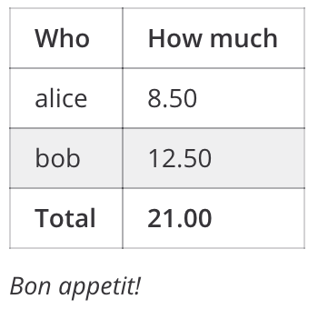

# Mattermost bots

Implementation of very simple bots responding to [Mattermost](https://mattermost.com/) slash commands.

## Build instructions

First, make sure you have [CMake](https://cmake.org/) (version >= 3.2), a recent C++ compiler and all the dependencies installed:

- [glog](https://github.com/google/glog)
- [Boost](https://www.boost.org/)

Very likely you can find packaged versions in your system's package repository.
Make sure you are installing the development version of the packages, which also include header files.
Another dependency is [JSON for Modern C++](https://nlohmann.github.io/json/), but it is currently included in `third_party/` as a header-only library.

Then, checkout the repository:

```
git clone git@github.com:ccicconetti/mmbots.git
git submodule update --init --recursive
```

Once everything is ready (assuming `clang++` is your compiler):

```
cd build/debug
../build.sh clang++
make
```

This will compile the binaries in `Executables`.

If you want to compile with compiler optimisations and no assertions:

```
cd build/release
../build.sh clang++
make
```

## Integration instructions

For the integration of these custom slash commands in your Mattermost server see [here](https://docs.mattermost.com/developer/slash-commands.html).

Basically you have to:

0. Select the server that will host the bot (e.g. `mmbots.snakeoil.com`) and pick a free TCP port (e.g. `10000`)
1. Add a custom slash command to your team via Mattermost client / web interface. In the `Request URL` put `http://mmbots.snakeoil.com:10000/`. Select `POST` as the `Request method`. This step will generate a token (say `TOKEN`), save it.
2. Run your bot on `mmbots.snakeoil.com` as a service with `--root http://mmbots.snakeoil.com:10000` and `--token TOKEN`. Note that the port `10000` must be reachable from your Mattermost server, not necessarily from the Internet at large (for security reasons, it is actually best if the bots are *not* reachable from the general public).
3. Done. If everything is correct you should be able to execute the slash command from the channel you have selected in Step 1. above.

## List of bots

### sushibot

Splits a discount on a shared cost, with optional delivery fee.
Originally developed to split the bill when ordering sushi at [our lab ](http://cnd.iit.cnr.it/).

Assume Alice and Bob ordered a meal together. Alice bought a 10$ pizza and Bob the same plus a 5$ beer, and they must pay a 1$ delivery fee, but use a 20% discount coupon. In MatterMost the slack command is:

```
/sushi Alice 10 Bob 10 5 discount 0.2 delivery 1
```

The bot response renders as:



If you want to try without installing on MatterMost, on one terminal run:

```
./sushibot --token TOKEN
```

On another run:

```
echo "token=TOKEN&text=alice+10+bob+10+5+discount+0.2+delivery+1" | \
curl -XPOST http://localhost:6500/ -d@-
```

The output is:

```
{"response_type":"in_channel","text":"| Who | How much |\n| - | - |\n| alice | 8.50 |\n| bob | 12.50 |\n| ** Total ** | ** 21.00 ** |\n_Bon appetit!_"}
```

The output will render as a table in a Mattermost client.

### coffeebot

Keeps track of the number of resources acquired by Mattermost users.
Currently used to keep track of who bought / how many coffee capsules at [our lab ](http://cnd.iit.cnr.it/).

Slash command help:

```
Commands:
/coffee 10
You took 10 coffee tabs (can be negative to fix mistakes).
/coffee show
Show the current coffee table
/coffee reset
Clear the current coffee table
/coffee help
Show this help
```

For instance, when hitting:

```
/coffee 10
```

The user issuing the command is charged for 10 units.

The bot saves its soft state on a file so that the current counters may survive service restarts.
The file path is specified using the `--persistence-file` command-line option.


### phonebot

Return the phone number of a person, as read from a text file specified using the `--input-file` command-line option.
The input file must have three columns separated by a tab:

- first column: name (may contain spaces)
- second column: unused (for future use)
- third column: phone number (may contain spaces)

If you want to try without installing on MatterMost, on one terminal run:

```
echo -e 'Claudio\tunused\t+39 555 123456' > phone_num.txt
./phonebot --token TOKEN --input phone_num.txt
```

On another run:

```
echo "token=TOKEN&text=claudio" | curl -XPOST http://localhost:6500/ -d@-
```

The output is (note the search is case-insensitive):

```
{"response_type":"in_channel","text":"| Person | Number |\n| - | - |\n| Claudio | +39 555 123456 |\n"}
```

The output will render as a table in a Mattermost client.
